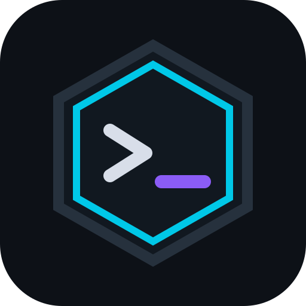

<p align="center">
  
</p>

<h1 align="center">Command Vault</h1>

<p align="center">
  A lightweight, local-first desktop vault for technical commands.
</p>

<p align="center">
  <strong>Current version: 0.2.0</strong>
</p>

<p align="center">
  <a href="#english">English</a> · <a href="#tiếng-việt">Tiếng Việt</a>
</p>

---

## English

### About

Command Vault is a native desktop application for organizing, searching, and safely using technical command references such as Linux, Nmap, Wireshark, tcpdump, Git, PowerShell, and Cisco commands.

The filesystem is the source of truth: folders in the Explorer are real folders, and every command collection is a readable UTF-8 `.cmdnote` JSON file. Command Vault uses no database, cloud service, account, telemetry, or background daemon.

### Highlights

- Native Tauri desktop app, optimized first for Kali Linux GNOME.
- Vanilla TypeScript, HTML, CSS, and Rust—no frontend framework.
- Stable shared 42/58 command-information grid.
- Nested filesystem Explorer with create, rename, delete, and refresh actions.
- Section and command CRUD, duplication, reordering, and moving between sections.
- Compact Table sections for dense command/port/function references without creating oversized cards.
- Runtime variables parsed from `{{variable}}` placeholders.
- Copy, structured Run, Open, and Open Terminal actions.
- Explicit `safe`, `caution`, and `danger` risk levels.
- Global in-memory search with `Ctrl+K`.
- Persisted whole-interface scaling from 75% to 200%, with `Ctrl++`, `Ctrl+-`, and `Ctrl+0` shortcuts.
- Atomic file writes and external-edit conflict detection.
- Resilient handling for malformed JSON, invalid schemas, missing files, and permissions.
- Dark cyber-minimal theme with soft neon accents.

### Interface size and accessibility

Version 0.2.0 adds Compact Tables while retaining the larger typography and interface scaling introduced in 0.1.2. The shared 42/58 grid remains stable at every supported scale.

- Open **Settings → UI scale** and choose any value from 75% to 200%.
- Press `Ctrl++` to increase scale by 10%.
- Press `Ctrl+-` to decrease scale by 10%.
- Press `Ctrl+0` to return to 100%.
- Scale, UI font size, and code font size are persisted between launches.

### Compact tables

Use **+ ADD TABLE** when many related commands or values should be scanned as one dense reference—for example common ports, Nmap scan modes, service probes, or Wireshark filters.

- The left 42% column contains the function label, generated command/value, and a COPY button at the end of every row.
- The right 58% column contains description, risk, and MORE/LESS details for variables, syntax, examples, and notes.
- Variables stay inside MORE in table mode so collapsed rows remain compact.
- Existing sections can switch between **Use Compact Table** and **Use Standard Rows** from the section menu without losing data.
- Add, edit, duplicate, reorder, move, delete, search, and runtime variable behavior are shared with regular commands.

### Technology

```text
Tauri 2
Vanilla TypeScript
HTML
CSS
Rust
```

Only one functional Tauri plugin is used: the official dialog plugin for the native folder picker.

### Kali/Debian prerequisites

```bash
sudo apt update
sudo apt install pkg-config libwebkit2gtk-4.1-dev librsvg2-dev
```

Install the stable Rust toolchain through [rustup](https://rustup.rs/) and install Node.js/npm if they are not already available.

### Development

```bash
npm install
npm run tauri dev
```

Build the frontend only:

```bash
npm run build
```

### Tests and checks

```bash
npm run test:model
cargo test --manifest-path src-tauri/Cargo.toml
cargo clippy --all-targets --manifest-path src-tauri/Cargo.toml -- -D warnings
npm audit --omit=dev
```

The project includes:

- TypeScript tests for parsing, validation, IDs, variables, and command safety.
- Rust tests for workspace confinement, symlink rejection, atomic writes, stale-write protection, filesystem CRUD, process parsing, and settings.
- A no-dependency Tauri IPC integration harness at `e2e.html`.
- A 20-section/100-row frontend stress scenario at `/?stress=1` during development.

### Release build

```bash
npm run tauri build
```

Configured Linux outputs:

```text
src-tauri/target/release/bundle/deb/
src-tauri/target/release/bundle/appimage/
```

The release profile enables LTO, size optimization, panic abort, and symbol stripping. Generated packages and build outputs are intentionally excluded from Git; publish binaries through GitHub Releases.

### Workspace format

```text
CommandVault/
├── Network/
│   ├── Wireshark.cmdnote
│   ├── Nmap.cmdnote
│   └── tcpdump.cmdnote
├── Linux/
│   └── Terminal.cmdnote
└── Development/
    └── Git.cmdnote
```

Minimal `.cmdnote` file:

```json
{
  "version": 1,
  "title": "Nmap",
  "description": "Network scanning commands",
  "sections": []
}
```

### Execution safety

- Direct Run always launches a program with an argument array; it never wraps arbitrary input in `sh -c`.
- Pipes, redirects, chaining, expansion, elevation, environment assignments, and shell interpreters are redirected to Open Terminal.
- Elevated commands request credentials only through the system terminal.
- Caution and danger actions require confirmation.
- Workspace paths are canonicalized and confined to the selected root.
- Symbolic links are not traversed or managed.
- Command files have a 5 MiB safety limit.
- Saves use a same-directory temporary file, sync, and atomic rename on Linux.
- Disk content is compared with the loaded version before save, preventing accidental overwrite of external edits.

---

## Tiếng Việt

### Giới thiệu

Command Vault là ứng dụng desktop dùng để tổ chức, tìm kiếm và sử dụng an toàn các câu lệnh kỹ thuật như Linux, Nmap, Wireshark, tcpdump, Git, PowerShell và Cisco.

Filesystem là nguồn dữ liệu duy nhất: folder trong Explorer là folder thật, và mỗi bộ câu lệnh là một file JSON `.cmdnote` UTF-8 có thể đọc bằng text editor. Command Vault không sử dụng database, cloud, tài khoản, telemetry hoặc daemon chạy nền.

### Tính năng nổi bật

- Ứng dụng desktop Tauri thực sự, ưu tiên Kali Linux GNOME.
- Vanilla TypeScript, HTML, CSS và Rust—không dùng frontend framework.
- Grid Command/Information 42/58 dùng chung và luôn thẳng hàng.
- Explorer filesystem lồng nhau với tạo, đổi tên, xóa và refresh.
- CRUD section/command, duplicate, sắp xếp và chuyển command giữa các section.
- Compact Table để tổng hợp dày các command, port hoặc chức năng liên quan mà không tạo quá nhiều card lớn.
- Tự phân tích runtime variable từ placeholder `{{variable}}`.
- Các action Copy, Run có cấu trúc, Open và Open Terminal.
- Risk level rõ ràng: `safe`, `caution`, `danger`.
- Tìm kiếm toàn workspace bằng `Ctrl+K`.
- Scale toàn giao diện từ 75% đến 200%, được lưu tự động; hỗ trợ `Ctrl++`, `Ctrl+-` và `Ctrl+0`.
- Ghi file atomic và phát hiện xung đột khi file bị sửa bên ngoài.
- Không crash khi JSON lỗi, schema sai, file bị xóa hoặc thiếu quyền.
- Giao diện dark cyber-minimal với soft neon nhẹ mắt.

### Kích thước giao diện và khả năng đọc

Phiên bản 0.2.0 bổ sung Bảng compact, đồng thời giữ typography lớn hơn và khả năng scale giao diện đã có từ 0.1.2. Grid 42/58 dùng chung vẫn ổn định ở mọi mức scale được hỗ trợ.

- Mở **Settings → UI scale** và chọn giá trị từ 75% đến 200%.
- Nhấn `Ctrl++` để tăng scale 10%.
- Nhấn `Ctrl+-` để giảm scale 10%.
- Nhấn `Ctrl+0` để trở về 100%.
- UI scale, UI font size và code font size được lưu giữa các lần mở ứng dụng.

### Bảng compact

Sử dụng **+ ADD TABLE** khi cần xem nhiều command hoặc giá trị liên quan trong cùng một bảng—ví dụ danh sách port phổ biến, các chế độ scan Nmap, service probe hoặc Wireshark filter.

- Cột trái 42% chứa tên chức năng, command/value đã generate và nút COPY ở cuối mỗi hàng.
- Cột phải 58% chứa description, risk và MORE/LESS cho variables, syntax, example và notes.
- Trong table mode, variable inputs chỉ xuất hiện khi mở MORE để các hàng collapsed luôn gọn.
- Section hiện có có thể chuyển giữa **Use Compact Table** và **Use Standard Rows** từ section menu mà không mất dữ liệu.
- Add, edit, duplicate, reorder, move, delete, search và runtime variable dùng chung với command thông thường.

### Công nghệ

```text
Tauri 2
Vanilla TypeScript
HTML
CSS
Rust
```

Chỉ sử dụng một plugin chức năng của Tauri: dialog plugin chính thức để mở native folder picker.

### Dependency cho Kali/Debian

```bash
sudo apt update
sudo apt install pkg-config libwebkit2gtk-4.1-dev librsvg2-dev
```

Cài Rust stable bằng [rustup](https://rustup.rs/) và cài Node.js/npm nếu hệ thống chưa có.

### Chạy môi trường development

```bash
npm install
npm run tauri dev
```

Chỉ build frontend:

```bash
npm run build
```

### Test và kiểm tra code

```bash
npm run test:model
cargo test --manifest-path src-tauri/Cargo.toml
cargo clippy --all-targets --manifest-path src-tauri/Cargo.toml -- -D warnings
npm audit --omit=dev
```

Project bao gồm:

- TypeScript tests cho parser, validation, ID, variable và command safety.
- Rust tests cho workspace boundary, symlink, atomic write, chống stale write, filesystem CRUD, process parser và settings.
- Tauri IPC integration harness không cần dependency bổ sung tại `e2e.html`.
- Frontend stress scenario 20 section/100 row tại `/?stress=1` trong development.

### Build bản release

```bash
npm run tauri build
```

Output Linux:

```text
src-tauri/target/release/bundle/deb/
src-tauri/target/release/bundle/appimage/
```

Release profile sử dụng LTO, tối ưu kích thước, panic abort và strip symbol. Package sinh ra và build output không được commit vào Git; binary nên được publish bằng GitHub Releases.

### Cấu trúc workspace

```text
CommandVault/
├── Network/
│   ├── Wireshark.cmdnote
│   ├── Nmap.cmdnote
│   └── tcpdump.cmdnote
├── Linux/
│   └── Terminal.cmdnote
└── Development/
    └── Git.cmdnote
```

File `.cmdnote` tối thiểu:

```json
{
  "version": 1,
  "title": "Nmap",
  "description": "Các lệnh quét mạng",
  "sections": []
}
```

### An toàn khi thực thi

- Direct Run luôn chạy program cùng argument array; không bọc input tùy ý bằng `sh -c`.
- Pipe, redirect, chaining, expansion, elevation, environment assignment và shell interpreter được chuyển sang Open Terminal.
- Command cần quyền cao chỉ hỏi mật khẩu qua system terminal.
- Action caution và danger luôn cần xác nhận.
- Mọi path được canonicalize và giới hạn trong workspace đã chọn.
- Không traverse hoặc quản lý symbolic link.
- File command có giới hạn an toàn 5 MiB.
- Khi save, app ghi file tạm cùng folder, sync và atomic rename trên Linux.
- Nội dung trên disk được so sánh với phiên bản đã load trước khi save, tránh ghi đè thay đổi từ bên ngoài.

---

## License

No license has been selected yet. Add a license before accepting external contributions.
